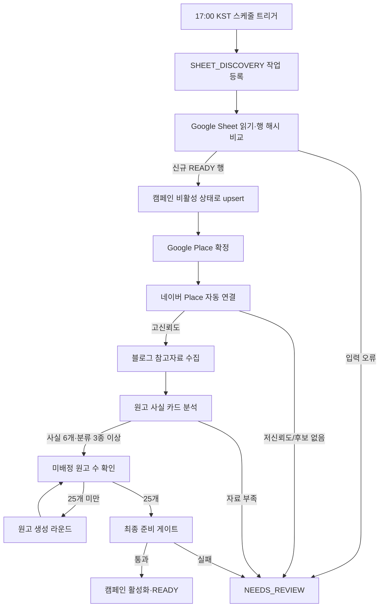

# PRD — 신규 캠페인 일일 자동화

> 상태: Draft v1 — 구현 전 검토 필요
> 작성일: 2026-07-27
> 대상 저장소: `googlemap-review-assist`
> 기준 시간대: `Asia/Seoul`
> 관련 문서: `docs/OPERATOR_CAMPAIGN_PRD.md`, `docs/OPERATIONS.md`

## 0. 결정사항과 가정

- “5시”는 매일 오후 5시, 즉 `17:00 Asia/Seoul`로 정의한다.
- Vercel Cron은 UTC 기준이므로 기본 스케줄 표현식은 `0 8 * * *`이다.
- 17시 작업은 긴 외부 API 작업을 직접 실행하지 않고, 해당 날짜의 발견 작업을 멱등하게 큐에 등록한 뒤 즉시 종료한다.
- 새 캠페인은 설정이 전부 끝나기 전까지 리뷰어에게 노출하지 않는다.
- 한 캠페인의 자동화 실패가 다른 캠페인의 처리를 막아서는 안 된다.
- “오류 없이”는 외부 API 장애가 절대 발생하지 않는다는 뜻이 아니라, 오류가 데이터 중복·부분 공개·작업 유실로 이어지지 않고 자동 재시도 또는 명확한 수동 확인 상태로 귀결된다는 뜻이다.
- 네이버 플레이스 자동 일치 신뢰도가 기준보다 낮으면 잘못 연결하지 않고 `NEEDS_REVIEW`로 격리한다.
- 시트 가이드라인은 쉼표로 분리된 키워드 배열로 저장하며, 원고 25개 전체에서 모든 키워드를 최소 한 번 이상 사용하고 각 원고는 배정된 키워드를 정확히 포함해야 한다.

## 1. 배경과 문제

현재 운영 흐름은 다음 이유로 무인 자동화에 적합하지 않다.

- Google Sheet 반영은 관리자 세션과 브라우저 요청에 의존한다.
- 시트 행의 안정적인 원본 식별자가 없어 행 이동이나 중복 실행 시 같은 캠페인을 확실하게 구분하기 어렵다.
- Google Place 확인과 캠페인 반영이 하나의 HTTP 요청에서 순차 실행된다.
- 현재 “원클릭 세팅”은 브라우저에서 네이버 자동 연결과 참고자료 수집을 캠페인별로 순차 호출한다.
- 원고 사실 카드 분석은 원클릭 세팅에 포함되지 않는다.
- 미배정 원고 25개 충전은 클라이언트가 최대 12회 생성 라운드를 반복 제어한다.
- 기존 `OperationalJob` 작업자는 한 번에 조회한 작업을 순차 처리하므로 장시간 AI 작업이 뒤의 작업을 막을 수 있다.
- Vercel Cron은 실패한 호출을 자동 재시도하지 않고 중복 호출이 발생할 수 있으므로, 단일 HTTP 실행에 전체 과정을 묶으면 작업 유실 또는 중복 위험이 있다.

## 2. 목표

매일 17:00 KST에 Google Sheet를 확인하고, 새로 접수된 유효 캠페인을 다음 상태까지 사람 개입 없이 준비한다.

1. 시트 신규 행 발견 및 캠페인 반영
2. Google Place 확정 및 캠페인 생성
3. 네이버 플레이스 자동 연결
4. 네이버 블로그 참고자료 수집
5. 원고 사실 카드 자동 분석
6. 품질 통과 미배정 원고 25개 확보
7. 최종 준비 조건 검증 후 캠페인 활성화

## 3. 비목표

- Google 리뷰 자동 게시
- 낮은 신뢰도의 네이버 장소 강제 연결
- 유효하지 않은 시트 행의 임의 보정
- 외부 API 장애를 숨기거나 무한 재시도
- 품질 제외 원고를 자동으로 미배정 원고로 승격
- 기존 리뷰어 배정 원고의 삭제 또는 재작성
- 네이버·Google 공급자 약관을 우회하는 크롤링

## 4. 사용자와 핵심 사용자 스토리

### 운영자

- 운영자는 매일 시트를 수동으로 확인하지 않아도 신규 캠페인이 자동 준비되기를 원한다.
- 운영자는 자동화가 어디까지 진행됐고 왜 멈췄는지 캠페인별로 확인하기를 원한다.
- 운영자는 실패한 단계만 재실행하고 이미 성공한 단계를 반복하지 않기를 원한다.

### 리뷰어

- 리뷰어는 장소 연결, 사실 카드, 미배정 원고가 모두 준비된 캠페인만 보아야 한다.
- 리뷰어에게 캠페인이 노출된 뒤 원고 부족으로 배정이 실패해서는 안 된다.

## 5. 성공 지표와 SLO

| 지표 | 목표 |
| --- | --- |
| 17시 발견 작업 시작 | 17:00~17:05 KST 이내 |
| 유효 신규 행 감지율 | 100% |
| 중복 캠페인 생성 | 0건 |
| 부분 준비 캠페인 공개 | 0건 |
| 신규 캠페인 자동 준비 시간 | P95 30분 이내, 최대 60분 이내 |
| 기준 처리량 | 신규 캠페인 20건/일을 60분 안에 처리 |
| 미배정 품질 통과 원고 | 활성화 시 정확히 25건 |
| 작업 유실 | 0건; 모든 작업은 완료·재시도·수동확인·최종실패 중 하나로 종료 |
| 운영자 원인 파악 시간 | 오류 발생 후 5분 이내 대시보드에 단계·원인·조치 표시 |

SLO 계산에서 시트 입력 오류, 낮은 장소 매칭 신뢰도처럼 자동 처리가 안전하지 않은 영구 오류는 제외하되 `NEEDS_REVIEW` 전환율로 별도 집계한다.

## 6. 전체 워크플로



## 7. 기능 요구사항

### FR-1. 일일 스케줄

- 매일 `17:00 Asia/Seoul`에 신규 캠페인 발견 작업을 등록한다.
- Vercel 기준 cron 표현식은 `0 8 * * *`를 사용한다.
- 트리거는 `runKey = NEW_CAMPAIGN_DAILY:<KST YYYY-MM-DD>`를 사용한다.
- 같은 날짜 트리거가 여러 번 호출돼도 `AutomationRun`은 하나만 생성되어야 한다.
- 17:10 KST까지 해당 날짜 실행이 없으면 동일 `runKey`로 보정 트리거를 실행한다.
- 정시 실행이 필수이므로 Vercel Hobby의 시간 단위 실행 오차는 허용하지 않는다. Production은 Vercel Pro 이상 또는 분 단위 실행을 보장하는 외부 스케줄러를 사용해야 한다.

### FR-2. 신규·변경 행 감지

- 시트 전체를 읽되 기존 행을 다시 캠페인으로 생성하지 않는다.
- 각 행은 다음 우선순위로 원본 키를 결정한다.

  1. 시트의 영구 `접수ID` 값
  2. 레거시 행은 `spreadsheetId + sheetId + 작성일 + 광고주명 + 랜딩URL + 시작일`의 정규화 해시

- 운영 시트에 숨김 또는 운영자용 `접수ID` 컬럼을 추가하는 것을 P0 선행조건으로 한다.
- 원본 행의 업무 데이터 해시를 저장해 `NEW`, `UNCHANGED`, `UPDATED`, `INVALID`를 구분한다.
- 행 번호는 표시와 오류 안내에만 사용하고 영구 식별자로 사용하지 않는다.
- 신규 `READY` 행만 신규 캠페인 자동화 파이프라인을 시작한다.
- 기존 행 변경 시 다음과 같이 처리한다.

  - 수량·기간만 변경: 캠페인 필드와 코드를 멱등 갱신한다.
  - 장소·가이드라인·예시문구 변경: 원고 입력 컨텍스트를 무효화하고 미배정 원고를 품질 제외한 뒤 사실 카드 분석과 25개 충전을 다시 실행한다.
  - 이미 배정된 원고는 변경하거나 삭제하지 않는다.

### FR-3. 캠페인 반영

- 시트 원본 레코드와 캠페인은 1:1로 연결한다.
- 신규 캠페인은 `active=false`, 자동화 상태 `SETTING_UP`으로 생성한다.
- Google Place가 확정되지 않으면 캠페인을 공개하지 않는다.
- 캠페인 생성, 시트 원본 연결, 가이드라인 저장은 하나의 데이터베이스 트랜잭션으로 처리한다.
- 같은 원본 키 또는 Google Place로 동시 요청이 들어와도 유니크 제약과 upsert로 하나의 캠페인만 남아야 한다.
- 기존 `businessId + campaign name` 문자열 매칭은 원본 행 식별의 보조 수단으로만 사용한다.

### FR-4. 네이버 플레이스 자동 연결

- 관리자 HTTP API를 내부에서 호출하지 않고 기존 네이버 도메인 함수를 서버 작업자가 직접 호출한다.
- 이미 `LINKED` 또는 `CONFIRMED`이고 유효한 숫자 Place ID가 있으면 즉시 성공 처리한다.
- Google Place 이름·주소를 기준으로 후보를 검색하고 기존 `MIN_AUTO_NAVER_MATCH_CONFIDENCE` 이상일 때만 저장한다.
- 후보 없음, 낮은 신뢰도, 서로 충돌하는 후보는 `NEEDS_REVIEW:NAVER_PLACE`로 전환한다.
- 네이버 연결 실패가 다른 캠페인의 참고자료 수집을 막아서는 안 된다.

### FR-5. 참고자료 수집

- 네이버 Place 연결 완료 후 `collectCampaignBlogReferences(campaignId)`를 실행한다.
- URL 유니크키로 upsert하며 같은 문서를 중복 저장하지 않는다.
- 활성 참고자료가 이미 존재하고 입력 컨텍스트 해시가 동일하면 외부 API 호출을 생략한다.
- 신규 캠페인은 활성 참고자료가 최소 1건 있어야 다음 단계로 진행한다.
- 공급자 미설정은 재시도하지 않는 구성 오류로 처리하고 전체 실행을 `DEGRADED`로 표시한다.

### FR-6. 원고 사실 카드 분석

- 참고자료 수집 완료 후 `extractCampaignDraftEvidence(campaignId)`를 실행한다.
- 결과는 기존 유니크키 `(campaignId, facet, fact, sourceRef)`로 upsert한다.
- 생성 전 준비 기준은 사실 카드 6개 이상 및 서로 다른 facet 3종 이상이다.
- 분석 입력 해시는 Google/Naver Place, 외부 리뷰, 블로그 참고자료, 메뉴, 관리자 승인 사실, 가이드라인 버전을 포함한다.
- 같은 입력 해시로 이미 준비 기준을 통과했다면 AI 분석을 다시 호출하지 않는다.
- 분석 결과가 0건이거나 준비 기준 미달이면 최대 재시도 후 `NEEDS_REVIEW:DRAFT_EVIDENCE`로 전환한다.

### FR-7. 미배정 원고 25개 자동 충전

- 서버 도메인에 `fillCampaignPreparedDraftPool(campaignId, target=25)`를 둔다.
- 현재 클라이언트의 `runCampaignDraftAutofill` 정책을 서버로 이동해 관리자 브라우저가 닫혀도 계속 진행한다.
- 매 라운드 전후 `qualityPassed=true AND assignedReceiptId IS NULL` 개수를 다시 조회한다.
- 25개 미만이면 `generateCampaignReviewDraftPreview`를 실행하고 다시 개수를 확인한다.
- 한 실행에서 최대 12라운드, 연속 무진전 최대 3라운드를 유지하되 서버리스 시간 예산이 60초 미만이면 다음 작업으로 이어서 처리한다.
- 작업 재시작 시 저장된 원고 수부터 이어가며 기존 품질 통과 원고를 다시 만들거나 삭제하지 않는다.
- 저장 단계에서 미배정 품질 통과 원고가 25개를 초과하지 않도록 원자적으로 필요한 수량만 반영한다.
- 생성 원고는 시트 가이드라인 키워드 계약과 기존 길이·문체·유사도·사실 카드 검증을 모두 통과해야 한다.
- 활성화 조건은 미배정 품질 통과 원고가 정확히 25개인 것이다.

### FR-8. 최종 활성화 게이트

다음 조건을 모두 만족할 때만 캠페인을 활성화한다.

- 시트 원본 행 상태가 `READY`
- Google Place가 확정됨
- 네이버 Place가 `LINKED` 또는 `CONFIRMED`
- 활성 참고자료 1건 이상
- 사실 카드 6개 이상, facet 3종 이상
- 미배정 품질 통과 원고 25개
- 기간·전체 수량·일 수량이 유효함
- 필요한 환경변수와 외부 공급자 구성이 정상임

활성화는 최종 검증과 같은 트랜잭션에서 `active=true`, 자동화 상태 `READY`로 변경한다.

## 8. 상태 모델

### 전체 실행 상태

- `QUEUED`: 일일 실행 등록됨
- `RUNNING`: 시트 발견 또는 하위 캠페인 작업 진행 중
- `COMPLETED`: 모든 신규 캠페인이 `READY` 또는 `NEEDS_REVIEW`로 종결됨
- `DEGRADED`: 일부 캠페인이 재시도 또는 수동 확인 상태
- `FAILED`: 시트 접근·DB 연결처럼 실행 전체를 막는 오류

### 캠페인 자동화 상태

- `DISCOVERED`
- `IMPORTING`
- `NAVER_LINKING`
- `REFERENCE_COLLECTING`
- `EVIDENCE_ANALYZING`
- `DRAFT_FILLING`
- `READY`
- `RETRY_WAIT`
- `NEEDS_REVIEW`
- `FAILED`

각 상태 변경은 `stageStartedAt`, `stageCompletedAt`, `attempts`, `lastErrorCode`, `lastErrorMessage`를 기록한다.

## 9. 데이터 모델

### `AutomationRun`

| 필드 | 설명 |
| --- | --- |
| `id` | 실행 ID |
| `type` | `NEW_CAMPAIGN_DAILY` |
| `runKey` | KST 날짜 기반 유니크키 |
| `scheduledFor` | 예정 시각 |
| `status` | 전체 실행 상태 |
| `discoveredCount` | 발견 행 수 |
| `createdCount` | 신규 캠페인 수 |
| `readyCount` | 자동 준비 완료 수 |
| `needsReviewCount` | 수동 확인 수 |
| `failedCount` | 최종 실패 수 |
| `startedAt`, `completedAt` | 실행 시간 |

### `SheetCampaignSource`

| 필드 | 설명 |
| --- | --- |
| `sourceKey` | 영구 접수ID 또는 레거시 해시, unique |
| `spreadsheetId`, `sheetId` | 원본 시트 |
| `rowNumber` | 현재 표시용 행 번호 |
| `contentHash` | 업무 데이터 변경 감지 |
| `rawSnapshotJson` | 민감정보를 제외한 정규화 스냅샷 |
| `campaignId` | 연결된 캠페인, unique |
| `status` | `NEW`, `SYNCED`, `INVALID`, `UPDATED` |
| `lastSeenAt`, `lastSyncedAt` | 감지·반영 시각 |

### `CampaignAutomationRun`

| 필드 | 설명 |
| --- | --- |
| `automationRunId`, `campaignId` | 복합 unique |
| `sourceKey` | 원본 접수 식별자 |
| `status`, `stage` | 현재 캠페인 상태와 단계 |
| `contextHash` | 장소·가이드·참고자료 입력 버전 |
| `attemptsByStageJson` | 단계별 시도 횟수 |
| `lastErrorCode`, `lastErrorMessage` | 운영자용 오류 |
| `nextRetryAt` | 재시도 예정 |
| `startedAt`, `completedAt` | 처리 시간 |

### `OperationalJob` 확장

- `automationRunId?`
- `campaignAutomationRunId?`
- `campaignId?`
- `stage?`
- `priority`
- `leaseExpiresAt?`
- `heartbeatAt?`

`dedupeKey` 예시는 `campaign-automation:<campaignId>:<contextHash>:DRAFT_FILLING`으로 한다.

## 10. 작업 큐와 병목 방지 설계

### 원칙

- 스케줄 트리거, 시트 읽기, 캠페인별 외부 작업을 서로 다른 job으로 분리한다.
- 한 캠페인의 단계는 순차 실행하지만 서로 다른 캠페인은 제한된 동시성으로 처리한다.
- 작업자는 job을 원자적으로 claim한 뒤 lease를 갱신한다.
- lease 만료 작업은 재수거해 서버리스 종료로 인한 유실을 복구한다.
- HTTP 요청의 수명에 전체 파이프라인을 묶지 않는다.

### 권장 동시성

| 작업 유형 | 동시성 | 이유 |
| --- | ---: | --- |
| 시트 발견 | 1 | 중복 전체 스캔 방지 |
| Google Place 확정 | 4 | 짧은 외부 I/O, 공급자 한도 보호 |
| 네이버 Place 연결 | 3 | 검색 API와 후보 확인 부하 제한 |
| 블로그 참고자료 수집 | 3 | 네이버 검색 쿼터 보호 |
| 사실 카드 분석 | 2 | Gemini 비용·45초 타임아웃 제어 |
| 원고 25개 생성 | 2 | 가장 긴 단계의 병렬 처리와 비용 제어 |

동시성은 환경변수로 조정하되 production 기본값을 코드에 안전하게 둔다.

```text
CAMPAIGN_AUTOMATION_TIMEZONE=Asia/Seoul
CAMPAIGN_AUTOMATION_GOOGLE_CONCURRENCY=4
CAMPAIGN_AUTOMATION_NAVER_CONCURRENCY=3
CAMPAIGN_AUTOMATION_EVIDENCE_CONCURRENCY=2
CAMPAIGN_AUTOMATION_DRAFT_CONCURRENCY=2
CAMPAIGN_AUTOMATION_MAX_CAMPAIGNS_PER_RUN=100
```

## 11. 멱등성·동시성·트랜잭션

- 날짜별 `AutomationRun.runKey`는 unique이다.
- `SheetCampaignSource.sourceKey`와 `campaignId`는 unique이다.
- 모든 stage job은 `campaignId + contextHash + stage` dedupe key를 사용한다.
- 캠페인별 `CampaignAutomationLease` 또는 동등한 unique DB lease를 사용해 자동 실행과 관리자 수동 실행이 동시에 원고를 생성하지 못하게 한다.
- 수동 실행 중 자동 작업이 시작되면 후발 실행은 `409 AUTOMATION_ALREADY_RUNNING` 또는 재시도 상태로 전환한다.
- 원고 풀 개수 확인과 저장은 동일 트랜잭션 또는 원자적 제한 로직으로 처리한다.
- 외부 API 호출은 DB 트랜잭션 밖에서 실행하고, 결과 저장만 짧은 트랜잭션으로 처리한다.
- 성공한 단계는 같은 `contextHash`에서 다시 호출하지 않는다.

## 12. 오류 분류와 재시도

| 오류 | 분류 | 정책 |
| --- | --- | --- |
| 429, 5xx, 네트워크 타임아웃 | 일시 오류 | 지수 백오프 + jitter 재시도 |
| DB 연결 실패 | 일시/전체 오류 | 실행 중단 후 전체 작업 재시도 |
| 환경변수 누락 | 구성 오류 | 즉시 `FAILED`, 재시도 금지, CRITICAL 기록 |
| 시트 필수값·날짜·수량 오류 | 입력 오류 | `NEEDS_REVIEW:SHEET_INPUT` |
| Google Place 미확정 | 입력/매칭 오류 | `NEEDS_REVIEW:GOOGLE_PLACE` |
| 네이버 낮은 신뢰도 | 매칭 오류 | `NEEDS_REVIEW:NAVER_PLACE` |
| 참고자료 0건 | 자료 부족 | 2회 검색 후 `NEEDS_REVIEW:REFERENCE_EMPTY` |
| 사실 카드 준비 기준 미달 | 자료 부족 | 2회 분석 후 `NEEDS_REVIEW:DRAFT_EVIDENCE` |
| 원고 무진전 3라운드 | 품질 오류 | `NEEDS_REVIEW:DRAFT_QUALITY` |
| 함수 종료·lease 만료 | 작업 중단 | lease 회수 후 저장 지점부터 재개 |

재시도 기본 간격은 `30초 → 2분 → 5분 → 15분`이며 20% jitter를 적용한다. 최대 시도 횟수는 Place·참고자료 4회, 사실 카드·원고 3회로 한다. 최종 실패 job은 삭제하지 않고 DLQ 성격의 `FAILED` 상태로 보존한다.

## 13. API 계약

### 내부 스케줄 API

#### `GET /api/internal/automation/new-campaigns/trigger`

- 인증: `Authorization: Bearer <CRON_SECRET>`
- 동작: 해당 KST 날짜의 `SHEET_DISCOVERY` job을 upsert하고 즉시 `202` 반환
- 응답:

```json
{
  "runId": "...",
  "runKey": "NEW_CAMPAIGN_DAILY:2026-07-27",
  "queued": true,
  "duplicate": false
}
```

#### `POST /api/internal/jobs/process`

- 기존 CRON 인증과 timing-safe 비교를 유지한다.
- 작업 claim과 제한 동시 실행만 담당한다.
- body의 `limit`는 최대 25로 제한한다.

### 관리자 API

- `GET /api/admin/automation-runs?limit=30`
- `GET /api/admin/automation-runs/{runId}`
- `POST /api/admin/campaigns/{campaignId}/automation/retry`
- `POST /api/admin/automation-runs/{runId}/retry-failed`

관리자 API는 세션·origin·rate limit을 유지하지만, 백그라운드 worker는 관리자 HTTP API를 호출하지 않고 도메인 서비스를 직접 사용한다.

## 14. 운영자 UX

관리자 캠페인 화면에 다음 정보를 추가한다.

- 마지막 시트 확인 시각과 다음 예정 시각
- 실행 상태: 진행 중, 완료, 일부 확인 필요, 실패
- 신규·변경·무시·오류 행 수
- 캠페인별 현재 단계와 진행률
- 다음 재시도 시각과 시도 횟수
- 오류 코드, 사용자 친화적 원인, 권장 조치
- 실패 단계만 다시 실행하는 버튼
- `NEEDS_REVIEW` 필터
- 미배정 원고 `n/25` 표시

수동 “원클릭 세팅”은 같은 서버 orchestration 서비스를 호출하는 복구 수단으로 유지하고, 브라우저 내 순차 호출 구현은 제거한다.

## 15. 관측성

### 로그·메트릭

- 모든 로그에 `runId`, `campaignId`, `sourceKey`, `jobId`, `stage`, `attempt`를 구조화 필드로 남긴다.
- 외부 URL, API 키, 인증 헤더, 시트 원문 전체는 로그에 남기지 않는다.
- 단계별 실행 시간과 공급자 응답 코드를 기록한다.
- 다음 지표를 집계한다.

  - `automation_runs_total{status}`
  - `campaign_automation_total{stage,status}`
  - `campaign_automation_duration_ms{stage}`
  - `operational_jobs_pending{type}`
  - `operational_jobs_stale_total`
  - `prepared_draft_unassigned_count{campaignId}`
  - `external_provider_errors_total{provider,code}`

### 알림

- 17:10까지 실행 미생성: CRITICAL
- 전체 시트 읽기 실패: CRITICAL
- job lease 10분 이상 정체: ERROR
- 캠페인 최종 실패: ERROR
- `NEEDS_REVIEW` 발생: WARNING
- pending job 100건 초과 또는 가장 오래된 job 15분 초과: ERROR

P0 알림 채널은 기존 관리자 오류 대시보드이며, Slack·이메일 전송은 후속 범위로 둔다.

## 16. 보안과 컴플라이언스

- 내부 스케줄 API는 `CRON_SECRET` 없이는 fail-closed한다.
- 비교는 기존처럼 길이 확인 후 `timingSafeEqual`을 사용한다.
- 시트 값, 검색 결과, 블로그 문서는 모두 신뢰하지 않는 입력으로 처리한다.
- LLM 프롬프트 안의 외부 문장은 명령이 아닌 인용 데이터로 표시하고 모델 결과는 서버 스키마와 출처 ID로 검증한다.
- `rawSnapshotJson`에는 자격증명·토큰을 저장하지 않는다.
- Google 리뷰 게시, 별점, 특정 긍정 경험을 자동화하지 않는다.
- 캠페인 활성화는 준비 상태만 의미하며 외부 리뷰 게시를 의미하지 않는다.

## 17. 테스트 전략

### 단위 테스트

- KST 날짜와 UTC cron 변환
- 시트 원본 키·content hash 안정성
- 신규/변경/미변경 행 분류
- stage 상태 전이
- 오류 분류와 백오프+jitter 범위
- 원고 풀 25개 충전 및 무진전 감지
- 활성화 게이트

### 통합 테스트

- 같은 시트 행을 두 번 처리해도 캠페인 1개만 존재
- 동시에 두 trigger가 와도 일일 run 1개만 존재
- 한 캠페인 외부 API 실패가 다른 캠페인 완료를 막지 않음
- worker 종료 후 lease 만료 작업이 이어서 처리됨
- 장소·가이드 변경 시 미배정 원고만 무효화되고 배정 원고는 보존됨
- 25개 중 일부 품질 제외 시 다음 라운드가 부족분만 충전
- 모든 가이드 키워드가 25개 원고 전체에 반영됨
- 최종 게이트 통과 전 캠페인이 리뷰어 목록에 노출되지 않음

### 장애 주입 테스트

- Google Sheets 429/500/timeout
- Google Places timeout
- 네이버 429/후보 없음/낮은 신뢰도
- Gemini 잘못된 JSON/빈 응답/timeout
- DB deadlock 또는 연결 중단
- 함수가 job claim 직후 종료되는 상황

### 부하 테스트

- 신규 캠페인 20건을 한 실행에 투입
- 외부 공급자별 동시성 상한이 지켜지는지 확인
- 60분 안에 모든 캠페인이 `READY` 또는 `NEEDS_REVIEW`로 종결되는지 확인
- 작업 큐가 단일 장기 작업 때문에 정체되지 않는지 확인

## 18. 프로젝트 규칙

### 명령

```powershell
npm ci
npx prisma generate
npm test
npx tsc --noEmit
npm run lint
$env:SESSION_SECRET='build-validation-only-0123456789abcdef'; npm run build
```

### 예상 구조

```text
app/api/internal/automation/new-campaigns/trigger/route.ts  # 짧은 cron trigger
app/api/internal/jobs/process/route.ts                     # 작업자 진입점
lib/domain/campaign-automation.ts                          # 상태 머신과 stage orchestration
lib/domain/operational-jobs.ts                             # claim, lease, retry, dispatch
lib/domain/google-sheet-campaign-sync.ts                   # 멱등 source upsert
lib/domain/campaign-draft-autofill.ts                      # 서버 원고 풀 충전
components/admin/AdminCampaignOperationsTable.tsx          # 실행 상태 표시·수동 재시도
test/campaign-automation.test.ts                            # 상태·멱등성·복구 통합 테스트
```

### 코드 스타일 예시

```ts
await enqueueOperationalJob({
  type: "CAMPAIGN_DRAFT_FILL",
  dedupeKey: `campaign-automation:${campaignId}:${contextHash}:DRAFT_FILLING`,
  payload: { runId, campaignId, contextHash },
});
```

- job type과 오류 코드는 대문자 스네이크 케이스를 사용한다.
- 사용자 메시지와 기술 오류 코드를 분리한다.
- route는 인증·입력 검증·응답만 담당하고 업무 로직은 도메인 함수에 둔다.
- 외부 API 호출과 긴 AI 호출을 DB 트랜잭션 안에서 실행하지 않는다.

### 경계

- Always: 입력 검증, 멱등키, 짧은 트랜잭션, 구조화 오류 기록, 테스트 후 병합
- Ask first: DB 마이그레이션, 새 외부 큐·알림 공급자 도입, 생산 동시성·비용 상향
- Never: 비밀값 커밋, 무한 재시도, 낮은 신뢰도 장소 강제 연결, 준비 전 캠페인 공개, 실패 테스트 삭제

## 19. 단계별 구현 계획

### Phase 1. 기반 상태와 멱등성

#### Task 1. 자동화 데이터 모델 추가

- Acceptance:
  - `AutomationRun`, `SheetCampaignSource`, `CampaignAutomationRun`이 추가된다.
  - production PostgreSQL과 개발 SQLite schema가 동일한 계약을 가진다.
  - unique key가 중복 일일 실행과 중복 시트 원본을 막는다.
- Verify: schema preservation 테스트, `npx prisma generate`, `npx tsc --noEmit`
- 예상 파일: Prisma schema 2개, migration/검증 테스트
- Dependencies: 없음

#### Task 2. 시트 원본 키와 변경 분류

- Acceptance:
  - 같은 행 재처리는 `UNCHANGED`이다.
  - 행 번호가 바뀌어도 접수ID가 같으면 같은 캠페인이다.
  - 업무 필드가 바뀌면 `UPDATED`와 context invalidation 범위가 계산된다.
- Verify: `test/google-sheet-import.test.ts`, 신규 순수 함수 테스트
- 예상 파일: sheet parser, sync domain, 테스트 1~2개
- Dependencies: Task 1

### Checkpoint A

- 같은 시트를 3회 처리해도 중복 캠페인이 없어야 한다.
- 배정된 원고와 기존 참여 데이터가 보존되어야 한다.

### Phase 2. 스케줄과 durable worker

#### Task 3. 일일 trigger와 catch-up 등록

- Acceptance:
  - `0 8 * * *` 스케줄이 해당 KST 날짜 run을 upsert한다.
  - 중복 호출은 같은 `runId`를 반환한다.
  - endpoint는 외부 작업 없이 2초 안에 응답한다.
- Verify: route auth, timezone, duplicate trigger 테스트
- 예상 파일: trigger route, `vercel.json`, automation domain, 테스트
- Dependencies: Task 1

#### Task 4. 작업 claim·lease·재시도 엔진

- Acceptance:
  - 동일 job은 한 worker만 claim한다.
  - lease 만료 job을 재수거한다.
  - 일시 오류와 영구 오류가 정책대로 분기된다.
- Verify: 병렬 claim, 함수 종료, 백오프 fake-timer 테스트
- 예상 파일: operational jobs domain, schema, route, 테스트
- Dependencies: Task 1

### Checkpoint B

- 외부 API를 호출하지 않는 fake pipeline이 20개 캠페인을 중복 없이 끝내야 한다.
- worker 강제 종료 후 이어서 완료되어야 한다.

### Phase 3. 캠페인별 자동화 stage

#### Task 5. 캠페인 비활성 import와 Place 연결 stage

- Acceptance:
  - 신규 캠페인은 `SETTING_UP`, `active=false`로 생성된다.
  - Google/Naver Place 성공 시 다음 job이 한 번만 등록된다.
  - 낮은 신뢰도는 `NEEDS_REVIEW`로 끝난다.
- Verify: sync·Naver 후보 통합 테스트
- 예상 파일: sync domain, Naver domain, automation domain, 테스트
- Dependencies: Tasks 2, 4

#### Task 6. 참고자료 수집 stage

- Acceptance:
  - 기존 참고자료가 있고 hash가 같으면 외부 호출을 생략한다.
  - 링크 중복이 없다.
  - 캠페인별 오류가 격리된다.
- Verify: 공급자 성공·429·0건 테스트
- 예상 파일: blog reference domain, automation domain, 테스트
- Dependencies: Task 5

#### Task 7. 사실 카드 분석 stage

- Acceptance:
  - 6개·3 facet 준비 기준을 통과해야 다음 단계가 등록된다.
  - 같은 input hash는 재분석하지 않는다.
  - 부족한 자료는 `NEEDS_REVIEW`로 표시한다.
- Verify: evidence unit/integration 테스트
- 예상 파일: evidence domain, automation domain, 테스트
- Dependencies: Task 6

#### Task 8. 서버 원고 풀 자동 충전

- Acceptance:
  - 브라우저 없이 미배정 품질 통과 원고가 25개가 된다.
  - 중단 후 현재 개수부터 재개한다.
  - 동시 수동·자동 생성에도 25개를 초과하지 않는다.
- Verify: 0/8/20/25개 시작, 품질 제외, 무진전, 동시성 테스트
- 예상 파일: 신규 autofill domain, review draft domain, worker dispatch, 테스트
- Dependencies: Tasks 4, 7

#### Task 9. 활성화 게이트

- Acceptance:
  - 모든 준비 조건을 한 번 더 검증한 후에만 `active=true`가 된다.
  - 실패 시 공개 상태가 변하지 않는다.
  - 준비 완료 로그와 실행 요약이 저장된다.
- Verify: reviewer availability 통합 테스트
- 예상 파일: automation domain, reviewer campaign query, 테스트
- Dependencies: Task 8

### Checkpoint C

- 실제 외부 API를 fake로 대체한 E2E에서 시트 신규 행이 `READY + 미배정 25개`로 완료되어야 한다.
- 각 stage 오류 주입 시 다른 캠페인은 완료되어야 한다.

### Phase 4. 운영 UX와 출시

#### Task 10. 관리자 진행 상태·재시도 UI

- Acceptance:
  - 마지막 실행, 캠페인별 stage, 오류, 재시도 시각을 볼 수 있다.
  - 실패 단계만 재시도할 수 있다.
  - 기존 원클릭 버튼은 서버 orchestration을 사용한다.
- Verify: component/API 테스트와 관리자 화면 수동 확인
- 예상 파일: admin query, API, operations table, component tests
- Dependencies: Tasks 3~9

#### Task 11. 운영 문서·알림·부하 검증

- Acceptance:
  - 배포 환경변수, cron, worker, 수동 복구 절차가 runbook에 있다.
  - 20개 캠페인 부하 테스트가 SLO를 충족한다.
  - 24시간 shadow mode 결과를 검토한 뒤 자동 활성화를 켠다.
- Verify: 전체 테스트·빌드·production smoke test
- 예상 파일: operations docs, env example, load test, rollout config
- Dependencies: Task 10

### Checkpoint D

- `npm test`, 타입 검사, lint, production build가 통과한다.
- 24시간 shadow mode에서 중복·부분 공개가 0건이다.
- 운영자 승인 후 `CAMPAIGN_AUTOMATION_AUTO_ACTIVATE=true`를 켠다.

## 20. 출시와 롤백

### 단계적 출시

1. `shadow`: 시트 감지와 실행 계획만 기록하고 캠페인을 만들지 않는다.
2. `import-only`: 캠페인을 비활성 생성하고 stage 계획만 기록한다.
3. `setup`: Place·참고자료·사실 카드·원고까지 만들되 활성화하지 않는다.
4. `auto-activate`: 최종 게이트 통과 캠페인을 자동 활성화한다.

### 롤백

- `CAMPAIGN_AUTOMATION_ENABLED=false`로 신규 trigger를 즉시 중단한다.
- 진행 중 job은 새 stage를 등록하지 않고 현재 저장 지점에서 종료한다.
- 자동화로 만든 캠페인은 source relation을 유지한 채 `active=false`로 보존한다.
- 이미 리뷰어에게 배정된 원고와 참여 기록은 롤백 시에도 삭제하지 않는다.
- 스키마 롤백보다 기능 플래그 중단을 우선한다.

## 21. 최종 수용 기준

- 매일 17:00 KST에 신규 행 검사가 시작된다.
- 같은 날짜 trigger를 여러 번 호출해도 실행은 한 번만 등록된다.
- 같은 시트 행을 반복 처리하거나 행 위치를 바꿔도 캠페인이 중복 생성되지 않는다.
- 신규 캠페인은 준비 완료 전 리뷰어에게 노출되지 않는다.
- 네이버 Place, 참고자료, 사실 카드가 정해진 기준으로 자동 준비된다.
- 모든 시트 가이드라인 키워드가 생성 원고 묶음에 실제 반영된다.
- 미배정 품질 통과 원고가 25개일 때만 캠페인이 활성화된다.
- 한 캠페인이 실패해도 나머지 캠페인은 계속 처리된다.
- 외부 API 일시 장애 후 저장된 진행 상태부터 자동 재개한다.
- 최종 실패와 수동 확인 건은 관리자 화면에서 원인과 조치를 확인할 수 있다.
- 전체 과정은 관리자 브라우저나 로그인 세션 없이 실행된다.

## 22. 구현 전 확인사항

- “5시”를 `17:00 KST`로 확정할지 최종 확인이 필요하다.
- 운영 Google Sheet에 영구 `접수ID` 컬럼을 추가할 위치를 정해야 한다.
- Production scheduler가 Vercel Pro인지 외부 분 단위 scheduler인지 확정해야 한다.
- 기준 처리량 20건/일과 Gemini 동시성 2가 실제 비용·할당량에 맞는지 확인해야 한다.
- 참고자료 0건을 무조건 수동 확인으로 막을지, Google 자료만으로 진행 가능한 예외 정책을 정해야 한다.

## 23. 참고자료

- [Vercel Cron Jobs — UTC 스케줄](https://vercel.com/docs/cron-jobs)
- [Vercel Cron 관리 — 중복 호출, 재시도 부재, 동시성·멱등성](https://vercel.com/docs/cron-jobs/manage-cron-jobs)
- [Vercel Function 최대 실행 시간](https://vercel.com/docs/functions/configuring-functions/duration)
